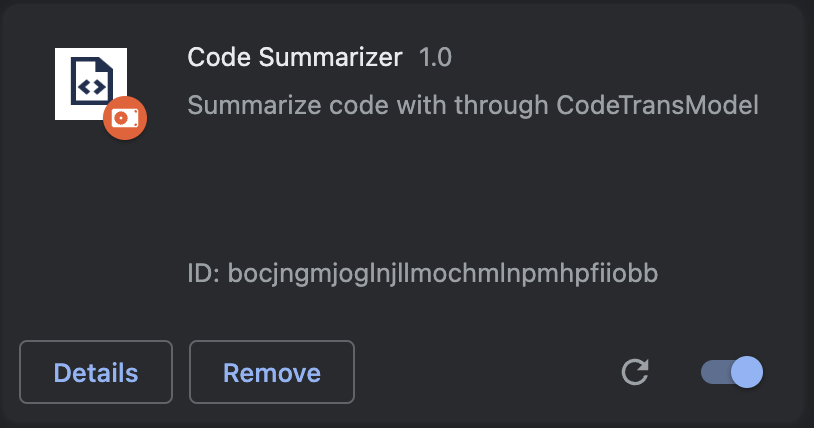
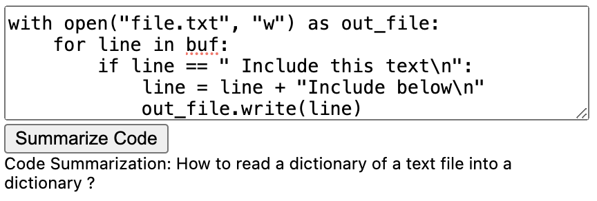
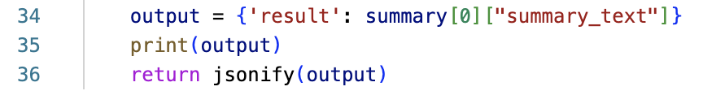

# CS410_TextInformationSystems
# Code summarization Chrome Extension
## Overview
This tool is a Chrome extension that can be used to generate Python code summarization with Python code entered in the box.
## Document
[Proposal](./Doc/Proposal.pdf)

[Progress_Report](./Doc/Progress_Report.pdf)
## Installation and Usage
### Install required packages
**Python version:** Python 3.10

Using a virtual environment by tools like anaconda is highly suggested. 
All the packages required for the tool are in the [requirements.txt](requirements.txt)

```
conda create --name CodeSummarization python=3.10
conda activate CodeSummarization
pip3 install -r requirements.txt
```

### Load Chrome Extension
1. Clone the repository \
`git clone https://github.com/huan1372/CS410_TextInformationSystems.git`
2. Go to Chrome extension by copy **chrome://extensions/** to Chrome.
3. Turn on the **Developer mode** in the top right corner\

4. Click the **Load unpacked** in the top left corner and choose the **Chrome_Extension** folder of this repository. \

5. You should be able to see the extension has been loaded to your All Extensions as below.\


### Run the Flask backend locally
```
cd Chrome_Extension/ 
python3 app.py
```

### Try Example
Now everything is set up, let's try a small example with the extension!

Copy the code (also in [Example_code/example2.py](Example_code/example2.py)) below to the text box of the extension and click the **Summarize Code**. 
You now should be able to see the code summarization result as shown below: **How to read a dictionary of a text file into a dictionary ?**.
```
with open("file.txt", "r") as in_file:
    buf = in_file.readlines()
    
with open("file.txt", "w") as out_file:
    for line in buf:
        if line == " Include this text\n":
            line = line + "Include below\n"
            out_file.write(line)
```


## Tool Implementation
### Backend: Code Summarization Model
This extension uses the **CodeTrans-TF-Base** from [CodeTrans](https://github.com/agemagician/CodeTrans/tree/main). This project does use pre-trained model due to limited computing resource. According to their repository, the python code summarization is around 10%, a surprisingly low accuracy. This is not abnormal, even recent papers do not have great models in the task of Python code summarization task.

This project also provides a Jupyter notebook [Model.ipynb](Model.ipynb) for you to try the model yourself. Make sure you change the environment to the virtual environment **CodeSummarization** you created in the Jupyter notebook!

The model is referred in the backend and return to frontend by flask. The code for using the model in the Chrome Extension can be seen in [Chrome-Extension/app.py](Chrome_Extension/app.py).
Devlopers can change the model to any model that can be used in python code. Developers only need to make sure the result of summary text is in the following format as line 34-36 so that frontend can parse the results correctly. For example, one could try to use Chatgpt API to generate the code summarization.\



### Frontend: The extension interface
Because this is a single person project, not enough time is assigned to design fancy user interface. The frontend interface is a very simple (see [Chrome-Extension/popup.html](Chrome_Extension/popup.html)), which contains a text input field to enter code, a button to submit entered code and a division to return the backend result. The [Chrome-Extension/popup.js](Chrome_Extension/popup.js) contains code needed to send request to, and fetch response from flask local server at http://127.0.0.1:5000/.

### Dataset 
The dataset contains problem descriptions and code in python language. This dataset is taken from [python_code_instructions_18k_alpaca](https://huggingface.co/datasets/iamtarun/python_code_instructions_18k_alpaca)

This project take "instruction" as the expected code summarization and "output" as the python code to be summarized.

You can see example of the data under [Example_code/](./Example_code/) (e.g. Train_0). You can also generate new example by changing **GENERATE_NUM** in the **Generate Data Example** section of [Dataset.ipynb](Dataset.ipynb) 

This dataset is choosen because it is smaller than BLUE dataset(the dataset used to train CodeTrans-TF-Base) is very large and therefore need a lot of computing resources.


### Evaluation
In the **Evaluation** section of [Dataset.ipynb](Dataset.ipynb), we evaluate this model with the dataset provided. Using a different dataset to test model also makes the result more trustable. 

The project uses the rouge score to measure the similarity between the desired output and the model output. The Recall-Oriented Understudy for Gisting Evaluation (ROUGE) scoring algorithm calculates the similarity between a candidate document and a collection of reference documents. Use the ROUGE score to evaluate the quality of document translation and summarization models.

ROUGE-2 F1-score around 0.1 to 0.2 may be considered low. ROUGE-2 F1-score around 0.2 to 0.4 may be considered moderate.ROUGE-1 F1-score around 0.4 to 0.5 may be considered moderate. ROUGE-1 F1-score above 0.5 is generally considered good. 
```
rouge = Rouge()
scores = rouge.get_scores(candidate_summary, reference_summary)
score_list.append(scores[0]['rouge-1']['f'])
```
Due to limited computing resources, we have run an evaluation for the first 1000 examples and plot the histogram as below.
As indicated, major prediction is not close to the truth. This does match their prediction of 10% get correct.\

## Contribution
This is a single-person project done by Shan Huang  (sh69@illinois.edu)